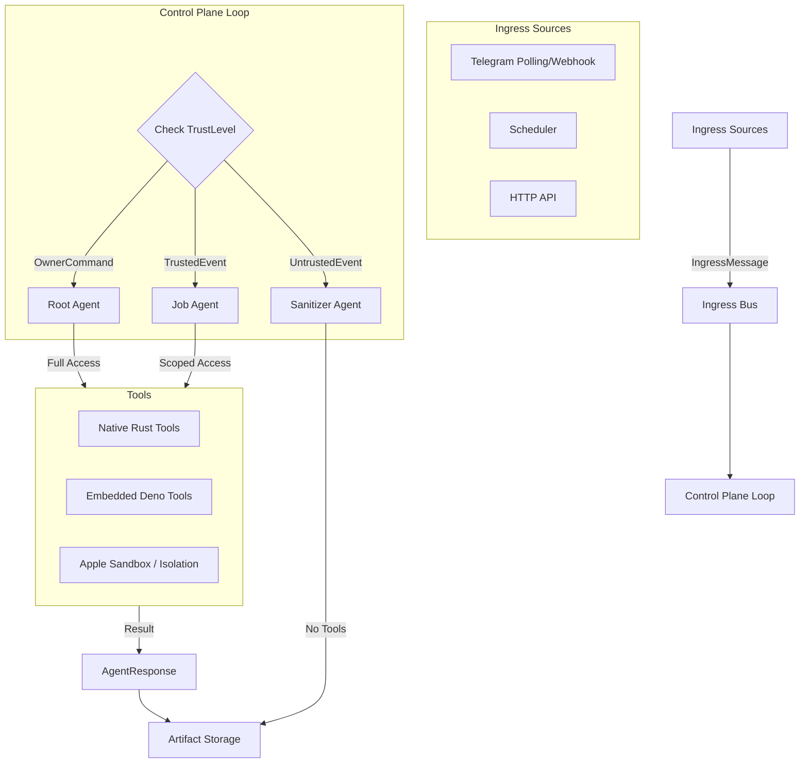

```
                  o         .      o     .        o          .      o      .
                   ᛏᚷᚱᛟᛏᛏᛟᛋᚨᚱᚢᚷᚱᛟᛏᛏᛟᛋᚨᚱᚢᚷᚱᛟᛏᛏᛟᛋᛋᛟᛏᛏᛟᚱᚷᚢᚱᚨᛋᛟᛏᛏᛟᚱᚷᚢᚱᚨᛋᛟᛏ
            ╔════════════════════════════════════════════════════════════════════╗
            ║ ░░░░ ▒▒▒ ▓▓▓ █ █ █ [  K E R N E L : O N  ] █ █ █ ▓▓▓ ▒▒▒ ░░░░░     ║
            ║ ░▒▓ ◢◤                                                       ◥◣ ▓▒░║
            ║ ░▒▓ █     ███████╗  ██╗  ███████╗  ██████╗         ▲         █ ▓▒░ ║
            ║ ░▒▓ █     ╚══███╔╝  ██║  ██╔════╝  ██╔══██╗       ▲ ▲        █ ▓▒░ ║
            ║ ░▒▓ █       ███╔╝   ██║  █████╗    ██████╔╝      ▲ ▲ ▲       █ ▓▒░ ║
            ║ ░▒▓ █      ███╔╝    ██║  ██╔══╝    ██╔══██╗     ▀▀▀█▀▀▀      █ ▓▒░ ║
            ║ ░▒▓ █     ███████╗  ██║  ███████╗  ██║  ██║        █         █ ▓▒░ ║
            ║ ░▒▓ █     ╚══════╝  ╚═╝  ╚══════╝  ╚═╝  ╚═╝        ▼         █ ▓▒░ ║
            ║ ░▒▓ ◥  ◣     :: ᚱ ᛟ ᚷ :: ᛟ ᚱ ᛏ :: ᚨ ᛋ ᚢ :: ᚱ ᛟ ᚷ ::   ◤  ▒░║
            ║ ░░░░ ▒▒▒ ▓▓▓ █ █ █ ▀▀▀▀▀▀▀▀▀▀▀▀▀▀▀▀▀▀▀▀▀▀▀ █ █ █ ▓▓▓ ▒▒▒ ░░░░░     ║
            ╚════════════════════════════════════════════════════════════════════╝
                     ᚨᚠᚢᚦᚨᚱᚲᚷᚱᛟᛏᛏᛟᛋᚨᚱᚢᚠᚦᚨᚱᚲᚷᚱᛟᛏᛏᛟᛟᛏᛏᛟᚱᚷᚲᚱᚨᚦᚠᚢᚱᚨᛋᛟᛏᛏᛟᚱᚷᚲ
                  °   .    o    .   °    .   o    .    °    .   o    .   °
```
# Zier-Alpha

A local-first cognitive kernel engineered in Rust. This is the alpha foundation of Vizier, a silicon-based Staffer that enforces a strict separation between cognition and execution. Featuring persistent memory and autonomous agency, it reserves the root context for reasoning while strictly confining tool use to secure, discrete environments.

For a detailed technical overview, see [ARCHITECTURE.md](ARCHITECTURE.md).

## Core Philosophy

* **Single binary** — No Node.js, Docker, or Python runtime dependencies for the core. Includes an embedded Deno engine for extensible JS/TS tooling.
* **Data sovereignty** — Runs entirely on localhost. Your memory and files never leave the device without explicit intent.
* **Persistent memory** — Markdown-based knowledge store with SQLite-backed hybrid (FTS + Vector) search.
* **Autonomous heartbeat** — Background event loop for scheduled tasks, system monitoring, and proactive workspace auditing.
* **Trust-aware ingress** — Architecturally distinguishes between Owner commands and external events (webhooks, news) to prevent prompt injection.
* **Secure sandbox** — Tools run in isolated environments (Apple Sandbox on macOS) to prevent data exfiltration.

## Installation

Zier-Alpha is currently distributed as source. You will need a Rust toolchain installed.

```bash
# Clone the repository
git clone https://github.com/zier-alpha-app/zier-alpha.git
cd zier-alpha

# Full install (includes desktop GUI)
cargo install --path .

# Headless install (server/daemon only)
cargo install --path . --no-default-features
```

## Quick Start

Initialize the configuration and workspace:

```bash
zier-alpha config init
```

Start an interactive chat session:

```bash
zier-alpha chat
```

Ask a single question from the CLI:

```bash
zier-alpha ask "Summarize the latest HN top stories"
```

Run as a background daemon (enables Heartbeat, Telegram, and HTTP API):

```bash
zier-alpha daemon start
```

## Architecture

Zier-Alpha implements the VIZIER architecture: a Secure Cognitive Kernel that decouples input sources from execution logic.



### Components

* **Ingress Bus:** A central broadcast channel that normalizes all inputs into `IngressMessage` structs with strict `TrustLevel` tagging.
* **Control Plane:** The main event loop. It routes `OwnerCommand` to the fully capable Root Agent and `UntrustedEvent` to a restricted Sanitizer.
* **Telegram Integration:** Supports both high-performance **Webhooks** (requires HTTPS) and zero-config **Long Polling** (works behind NAT/Firewalls).
* **Embedded Scripting:** Features a built-in Deno runtime, allowing you to write custom tools in TypeScript/JavaScript without external dependencies.
* **Artifact Store:** Instead of unstructured logs, Zier-Alpha writes structured Markdown files with strict provenance metadata (timestamp, model, trust level).

## Workspace Structure

```text
~/.zier-alpha/workspace/
├── MEMORY.md            # Long-term knowledge (auto-loaded)
├── SOUL.md              # Persona and behavior definition
├── IDENTITY.md          # Agent identity context
├── USER.md              # User preferences and info
├── HEARTBEAT.md         # Autonomous task queue
├── extensions/          # Custom JS/TS tools (Deno)
└── artifacts/           # Structured outputs (reports, summaries)
```

## Configuration

Stored at `~/.zier-alpha/config.toml`.

```toml
[agent]
default_model = "claude-cli/opus"
context_window = 128000

[server]
enabled = true
port = 31327
# "polling" (no HTTPS needed) or "webhook"
telegram_mode = "polling"
owner_telegram_id = 123456789
telegram_bot_token = "..."
# Required only for webhook mode
telegram_secret_token = "..."

[heartbeat]
enabled = true
interval = "30m"

[memory]
workspace = "~/.zier-alpha/workspace"
# "local" (requires fastembed feature), "openai", or "none"
embedding_provider = "none"
```

## License

Apache-2.0
