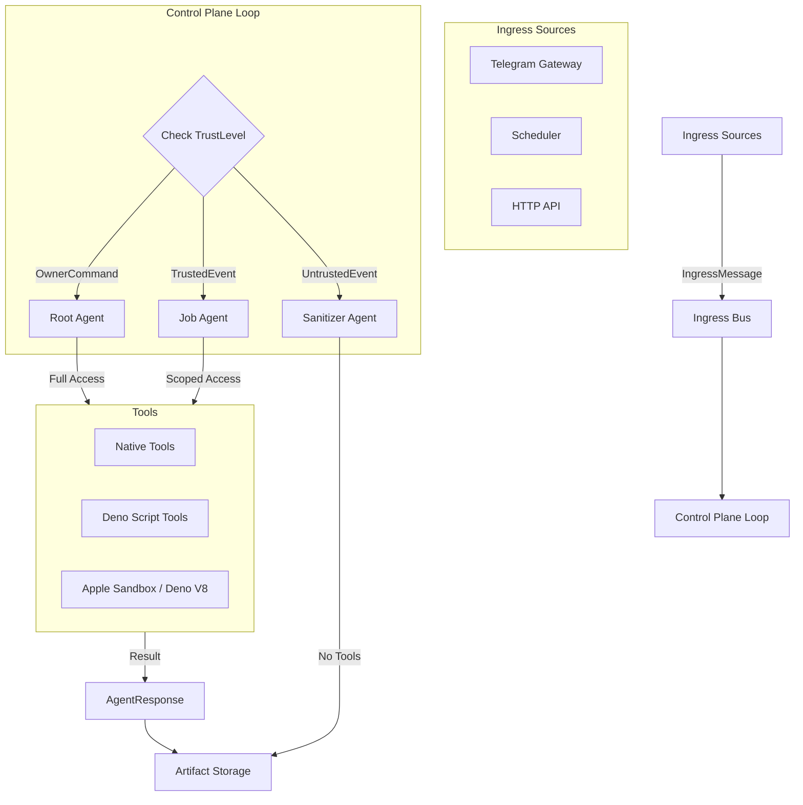

# LocalGPT

A local device focused AI assistant built in Rust — persistent memory, autonomous tasks, ~27MB binary. Inspired by and compatible with OpenClaw.

`cargo install localgpt`

## Why LocalGPT?

- **Single binary** — no Node.js, Docker, or Python required
- **Local device focused** — runs entirely on your machine, your memory data stays yours
- **Persistent memory** — markdown-based knowledge store with full-text and semantic search
- **Autonomous heartbeat** — delegate tasks and let it work in the background
- **Multiple interfaces** — CLI, web UI, desktop GUI
- **Multiple LLM providers** — Anthropic (Claude), OpenAI, Ollama
- **OpenClaw compatible** — works with SOUL, MEMORY, HEARTBEAT markdown files and skills format

## Install

```bash
# Full install (includes desktop GUI)
cargo install localgpt

# Headless (no desktop GUI — for servers, Docker, CI)
cargo install localgpt --no-default-features
```

## Quick Start

```bash
# Initialize configuration
localgpt config init

# Start interactive chat
localgpt chat

# Ask a single question
localgpt ask "What is the meaning of life?"

# Run as a daemon with heartbeat, HTTP API and web ui
localgpt daemon start
```

## How It Works

LocalGPT uses plain markdown files as its memory:

```
~/.localgpt/workspace/
├── MEMORY.md            # Long-term knowledge (auto-loaded each session)
├── HEARTBEAT.md         # Autonomous task queue
├── SOUL.md              # Personality and behavioral guidance
└── knowledge/           # Structured knowledge bank (optional)
    ├── finance/
    ├── legal/
    └── tech/
```

Files are indexed with SQLite FTS5 for fast keyword search, and sqlite-vec for semantic search with local embeddings 

## Configuration

Stored at `~/.localgpt/config.toml`:

```toml
[agent]
default_model = "claude-cli/opus"

[providers.anthropic]
api_key = "${ANTHROPIC_API_KEY}"

[heartbeat]
enabled = true
interval = "30m"
active_hours = { start = "09:00", end = "22:00" }

[memory]
workspace = "~/.localgpt/workspace"
```

## CLI Commands

```bash
# Chat
localgpt chat                     # Interactive chat
localgpt chat --session <id>      # Resume session
localgpt ask "question"           # Single question

# Daemon
localgpt daemon start             # Start background daemon
localgpt daemon stop              # Stop daemon
localgpt daemon status            # Show status
localgpt daemon heartbeat         # Run one heartbeat cycle

# Memory
localgpt memory search "query"    # Search memory
localgpt memory reindex           # Reindex files
localgpt memory stats             # Show statistics

# Config
localgpt config init              # Create default config
localgpt config show              # Show current config
```

## HTTP API

When the daemon is running:

| Endpoint | Description |
|----------|-------------|
| `GET /health` | Health check |
| `GET /api/status` | Server status |
| `POST /api/chat` | Chat with the assistant |
| `GET /api/memory/search?q=<query>` | Search memory |
| `GET /api/memory/stats` | Memory statistics |

## Blog

[Why I Built LocalGPT in 4 Nights](https://localgpt.app/blog/why-i-built-localgpt-in-4-nights) — the full story with commit-by-commit breakdown.

## VIZIER Architecture

LocalGPT operates as a "Secure Cognitive Kernel" (VIZIER), decoupling input handling from execution to ensure safety and stability.



### Key Components

*   **Ingress Bus** ([`src/ingress/bus.rs`](src/ingress/bus.rs)): Central event bus that decouples input sources (Telegram, Cron) from execution logic.
*   **Control Plane** ([`src/cli/daemon.rs`](src/cli/daemon.rs)): The main loop that consumes events, determines `TrustLevel`, and initializes the appropriate Agent persona.
*   **Scheduler** ([`src/scheduler/mod.rs`](src/scheduler/mod.rs)): `cron`-based job scheduler that emits trusted events to the bus.
*   **Scripting Engine** ([`src/scripting/deno.rs`](src/scripting/deno.rs)): Embedded Deno runtime for executing sandboxed JS/TS tools.
*   **Sandbox Policy** ([`src/config/sandbox.rs`](src/config/sandbox.rs)): Defines file system and network allowances for tools.

## Built With

Rust, Tokio, Axum, SQLite (FTS5 + sqlite-vec), fastembed, eframe, Deno Core

## Contributors

<a href="https://github.com/localgpt-app/localgpt/graphs/contributors">
  
</a>

## Stargazers

[](https://star-history.com/#localgpt-app/localgpt&Date)

## License

[Apache-2.0](LICENSE)
